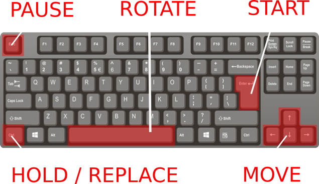

# Tetris web app

## Demo

You can play the game here:

[Tetris by Irakli M.](https://iraklimt.gitlab.io/tetris/)

## Abstract

The main goal of this project is to reproduce the mythical tetris game adapted to the web technology testing my knowledge and developer skills as well as create a funny and main browsers/devices compatible game.

## Architecture

In general terms, the project is a SPA (Single Page Application) built on [Reac JS](https://reactjs.org/) using the [Create React App](https://create-react-app.dev/) boilerplate and managed by npm (Node Package Modules).

Regarding to data managing, the application doesn't use any database, relying the whole lifecycle on the ReactJS state management and storing users score in the browser's local storage.

The user interface is responsive and browser compatible made by a combination of CSS, HTML and JAVASCRIPT (scss/html5/ES6) and the rendering process is implemented by the direct DOM manipulation (without html canvas graphics). The Audio effects and sound management relys on the [Howler.js](https://howlerjs.com/) package

## Instructions

The game has two ways to interact with it depending on the device and the user preferences.
For the desktop browsers the recommended way is using the keyboard, which is more comfortable and users friendly. Otherwhise, in all the screen touchable devices the user always can interact pressing/tapping the virtual interface buttons.

In the keyboard:

- Start Game: `Enter key`
- Stop/resume: `Esc key`
- Flip figure: `Space key`
- Hold/Use figure: `Ctrl key`
- Move Left: `Left arrow key`
- Move Right: `Right arrow key`
- Move Down: `Down arrow key`

## References

Although the whole project is made by the author (obviously excluding third party libraries, frameworks, npm packages), there are parts/processes of the project that are inspired in other professionals work that worths to mention in order to thank and recognize their work.

- [Inspiring tutorial by Meth Meth Method](https://www.youtube.com/watch?v=H2aW5V46khA)
- [Interface design inspiration by MDM team](dribbble.com/mdm_ooo)
- [Dark starry background by Saransh Sinha](linkedin.com/in/saranshsinha)
- [Tetris loader by Joren Van Hee](https://github.com/JorenVanHee)
- [Original Tetris theme (Tetris Soundtrack)](https://www.youtube.com/watch?v=NmCCQxVBfyM)
- [Tetris audio effects](https://www.findsounds.com/ISAPI/search.dll?keywords=tetris)
- [Tetris wiki](https://tetris.wiki)

## License

[MIT License](https://en.wikipedia.org/wiki/MIT_License)
